# Sundarikku Pottu Thoduna — PottuAI Cheat with Oracle

PottuAI is a camera-based Onam game that guides a red marker toward a player's forehead and turns the completed hand path into a playful Malayalam horoscope.

The current application is implemented in `game.py`. OpenCV handles player selection and gameplay, local/LAN Gemma 4 generates the Oracle reading through Ollama, Gemini Live provides Malayalam speech, and PySide6 displays the celebration and result screens. An optional ESP32 can receive the same movement commands over USB serial.

The configured models and responsibilities are:

- `gemma4:e2b` through Ollama: multimodal Malayalam horoscope generation, with an automatic telemetry-only retry if image input fails.
- `gemini-3.1-flash-live-preview`: Malayalam direction clips and spoken narration of the Gemma-generated horoscope.

## Features

- Detects the largest visible face with OpenCV's bundled Haar cascade.
- Estimates the forehead target from the detected face rectangle.
- Tracks a saturated red marker in HSV colour space.
- Generates `LEFT`, `RIGHT`, `UP`, `DOWN`, and `STOP` commands.
- Sends changed commands to an optional ESP32 at `115200` baud.
- Provides five persistent player slots labelled `A`, `B`, `C`, `D`, and `E`, selected by holding the red marker over a letter for three seconds.
- Stores attempts and Oracle history separately for each player and displays a persistent accuracy leaderboard.
- Uses Gemini Live to generate Malayalam direction clips and caches them locally for low-latency playback.
- Records the marker path internally without displaying the trajectory during gameplay.
- Measures completion time, path length, path efficiency, command counts, and direction reversals.
- Sends the clean final frame, a private path visualization, telemetry, and recent results to Gemma 4 through Ollama for a unique Malayalam horoscope.
- Automatically retries Gemma with telemetry only if the Ollama model rejects image input.
- Randomly plays one local win sound and displays a full-screen congratulations screen for at least five seconds after reaching the target.
- Generates the Oracle while the celebration is visible, then displays and narrates it in a full-screen PySide6 result window.
- Cancels superseded playback and background narration so audio from an earlier round cannot leak into a new round.
- Supports replaying as the same player or returning to the camera-based player selector without restarting the application.

## How it works

```text
USB camera
    |
    +--> red-marker hold selector --> player A / B / C / D / E
    |
    +--> Haar face detection --> forehead target
    |
    +--> HSV red-marker tracking --> marker position
                                      |
target + marker --> verified direction + path telemetry
                         |                    |
                         |                    +--> Ollama / Gemma 4
                         |                         + clean final frame
                         |                         + private path image
                         |                         + recent history
                         |                         + Malayalam horoscope
                         |                                  |
                         |                                  +--> PySide6 result UI
                         |                                  +--> Gemini Live narration
                         |
                         +--> cached Gemini Live direction audio
                         +--> optional ESP32 command over serial

target reached --> stop guidance audio + close camera
                         |
                         +--> random audio/win1..win4 sound
                         +--> congratulations screen (minimum 5 seconds)
                                      |
                                      +--> Oracle result UI
```

The camera and OpenCV window are closed before the celebration and Oracle windows open. The marker trajectory is never drawn on the public gameplay, celebration, or result view; it is rendered only into the private diagnostic image sent to the configured Ollama server. Oracle generation runs during the celebration to reduce waiting, but narration does not start until the new Oracle text is visible.

## Requirements

- Python 3.10 or newer
- A USB camera
- An Ollama server with the `gemma4:e2b` model, running locally or on the same network
- A Gemini API key for Malayalam speech generation
- An internet connection when Gemini Live needs to generate direction audio or Oracle narration
- Network access from PottuAI to the configured Ollama server
- `paplay` (PulseAudio/PipeWire) or `aplay` (ALSA) for spoken audio
- Qt Multimedia support from PySide6 for MP3/WAV celebration playback
- A Malayalam font, preferably Noto Sans Malayalam
- Optional: an ESP32 connected over USB serial

## Raspberry Pi setup

Install the system packages:

```bash
sudo apt update
sudo apt install -y \
  python3-venv \
  pulseaudio-utils \
  alsa-utils \
  fonts-noto-core \
  fonts-noto-extra \
  libgl1
```

Create a virtual environment and install the Python dependencies:

```bash
python3 -m venv venv
source venv/bin/activate
python -m pip install --upgrade pip
python -m pip install -r requirements.txt
```

## Gemma 4 and Ollama setup

On the computer that will run Gemma 4, install Ollama and make sure the model configured by `game.py` is available:

```bash
ollama pull gemma4:e2b
ollama serve
```

The application calls Ollama's `/api/chat` endpoint directly, so it does not require an additional Python Ollama package. By default it connects to:

```text
http://192.168.11.157:11434
```

If Ollama is on another computer, configure Ollama to accept LAN connections and ensure port `11434` is reachable. Point PottuAI to the correct server with `POTTU_OLLAMA_URL`.

## Run PottuAI

Set the Gemini API key and, when necessary, override the Ollama URL:

```bash
export GEMINI_API_KEY="your-api-key"
export POTTU_OLLAMA_URL="http://192.168.11.157:11434"
python game.py
```

On the first run, PottuAI asks Gemini Live to create five short Malayalam direction clips. It stores the raw PCM files in `.pottuai_gemini_audio/` and reuses them on later runs.

## Configuration

Gemma horoscope generation and Gemini speech are independent. `POTTU_OLLAMA_URL` selects the Gemma server, while `GEMINI_API_KEY` enables speech.

| Environment variable | Default | Purpose |
| --- | --- | --- |
| `GEMINI_API_KEY` | unset | Enables Gemini Live direction audio and Oracle narration. |
| `POTTU_OLLAMA_URL` | `http://192.168.11.157:11434` | Ollama base URL used for the Gemma 4 Oracle request. |
| `POTTU_CAMERA` | `0` | OpenCV camera index. |
| `POTTU_SERIAL_PORT` | unset | ESP32 device, such as `/dev/ttyUSB0`; serial is disabled when unset. |
| `POTTU_TARGET_TOLERANCE` | `30` | Target radius in pixels at which `STOP` is issued. |
| `POTTU_AXIS_TOLERANCE` | `20` | Pixel dead zone used to choose the movement axis. |
| `POTTU_GUIDANCE_COOLDOWN` | `1.3` | Seconds before repeating an unchanged spoken command. |
| `POTTU_RED_MIN_AREA` | `500` | Minimum accepted red contour area in pixels. |
| `POTTU_AUDIO_SINK` | automatic | PulseAudio/PipeWire sink name; useful for selecting a Bluetooth device. |
| `POTTU_GEMINI_AUDIO_CACHE` | `.pottuai_gemini_audio` | Directory for cached 24 kHz mono PCM direction clips. |
| `POTTU_PLAYER_FILE` | `pottuai_players.json` | Persistent player attempts, leaderboard data, and player-specific Oracle history. |
| `POTTU_EMOJI_HOLD_SECONDS` | `3.0` | Seconds the red marker must remain over a player letter. The legacy variable name is retained for compatibility. |

Example:

```bash
POTTU_CAMERA=1 \
POTTU_SERIAL_PORT=/dev/ttyACM0 \
POTTU_OLLAMA_URL=http://192.168.11.157:11434 \
POTTU_AUDIO_SINK=bluez_output.YOUR_DEVICE_NAME \
python game.py
```

## Gameplay and controls

1. Hold the red marker over player letter `A`, `B`, `C`, `D`, or `E` for three seconds.
2. Keep one face clearly visible to the camera.
3. Move a sufficiently large, saturated red marker toward the yellow forehead target.
4. Follow the English on-screen command or the spoken Malayalam direction.
5. When the marker enters the target radius, the app sends `STOP`, stops guidance audio, and closes the camera view.
6. A congratulations screen plays one randomly selected win sound. It remains visible for at least five seconds and allows a longer sound to finish cleanly.
7. The Oracle result opens after the celebration. Its Malayalam narration begins only when the new Oracle text is visible.

Controls:

- `Q` or `Esc` exits from the camera or Oracle result window.
- The result buttons replay as the current player, change player, or exit.

Gemma first receives both images and the measured telemetry. If that multimodal request fails, PottuAI retries the same model using telemetry only. If the Ollama server or both Gemma requests fail, the result UI uses a deterministic Malayalam fallback horoscope. Spoken guidance requires either previously cached direction clips or a valid Gemini API key; narration requires a valid key and a successful Gemini Live audio response.

## ESP32 serial integration

Set `POTTU_SERIAL_PORT` to enable serial output. PottuAI sends newline-terminated command strings only when the command changes:

```text
LEFT\n
RIGHT\n
UP\n
DOWN\n
STOP\n
```

The ESP32 firmware should listen at `115200` baud and map these commands to the project hardware. PottuAI sends `STOP` before closing the serial connection. List available ports with:

```bash
python -m serial.tools.list_ports
```

Use a regulated external supply for servos and connect the ESP32 and servo-supply grounds together. Do not power servos directly from Raspberry Pi GPIO.

## Bluetooth/audio output

Run PottuAI as the signed-in desktop user rather than with `sudo`. It prefers a detected Bluetooth PulseAudio/PipeWire sink, then the default PulseAudio/PipeWire sink, and finally the default ALSA device.

Inspect available sinks with:

```bash
pactl info
pactl list short sinks
```

Select a particular sink with `POTTU_AUDIO_SINK` if multiple Bluetooth devices are connected.

## Project structure

```text
.
├── game.py             # Current letter-player game and Oracle application
├── audio/
│   ├── win1.mp3        # Random celebration sound 1
│   ├── win2.wav        # Random celebration sound 2
│   ├── win3.wav        # Random celebration sound 3
│   └── win4.wav        # Random celebration sound 4
├── pottu_ai.py         # Earlier application entry point
├── requirements.txt    # Runtime Python dependencies
├── images/             # Prototype development photos
├── models/             # Earlier face-model resources (not used by game.py)
└── archive/            # Previous application iterations
```

## Troubleshooting

If the camera cannot open, verify the index with `POTTU_CAMERA` and make sure no other program is using it. On Linux, `game.py` opens the camera through V4L2.

If `cv2.CascadeClassifier` or `cv2.imshow` is unavailable, remove conflicting or headless OpenCV distributions and reinstall the requirements:

```bash
python -m pip uninstall -y \
  cv2 \
  opencv-python \
  opencv-python-headless \
  opencv-contrib-python \
  opencv-contrib-python-headless
python -m pip install --no-cache-dir --force-reinstall -r requirements.txt
python -c "import cv2; print(cv2.__version__, cv2.CascadeClassifier)"
```

If Malayalam text renders as boxes, install the Noto font packages above and restart the application. If guidance or Oracle speech is silent, confirm that either `paplay` or `aplay` is installed and test the selected sink outside PottuAI. If celebration audio is silent, confirm that all four files exist under `audio/` and that the PySide6 installation includes `PySide6.QtMultimedia`.

Only one celebration file is selected per win. Navigation audio is stopped as soon as the target is reached, celebration playback is stopped before opening the Oracle, and Oracle playback is cancelled on replay, player change, or exit. A generation guard also prevents a delayed response from an older Oracle request from playing during a later round.

If the Oracle status shows `LOCAL GEMMA OFFLINE`, verify the Ollama server and model from the PottuAI machine:

```bash
curl http://192.168.11.157:11434/api/tags
```

Replace the address with `POTTU_OLLAMA_URL` when using a different host. Confirm that `gemma4:e2b` is listed and that the Ollama host permits connections from the Raspberry Pi.

## Development photos

### Phase 1

<table>
  <tr>
    <td width="50%">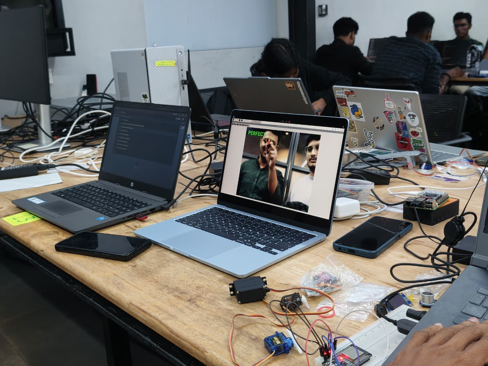</td>
    <td width="50%">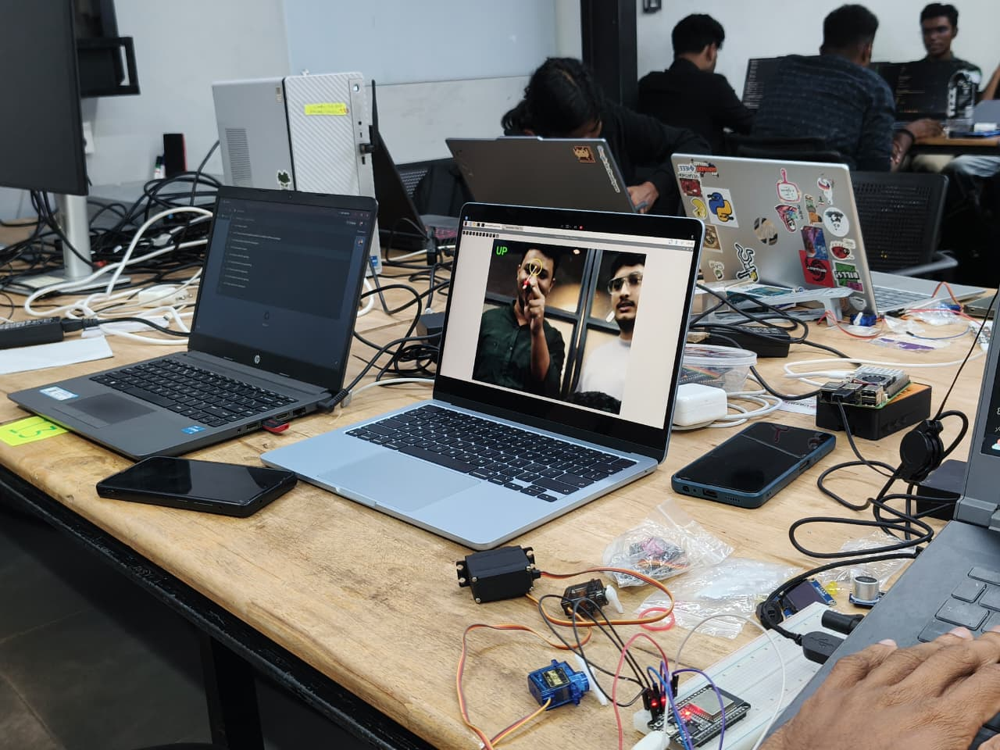</td>
  </tr>
  <tr>
    <td width="50%">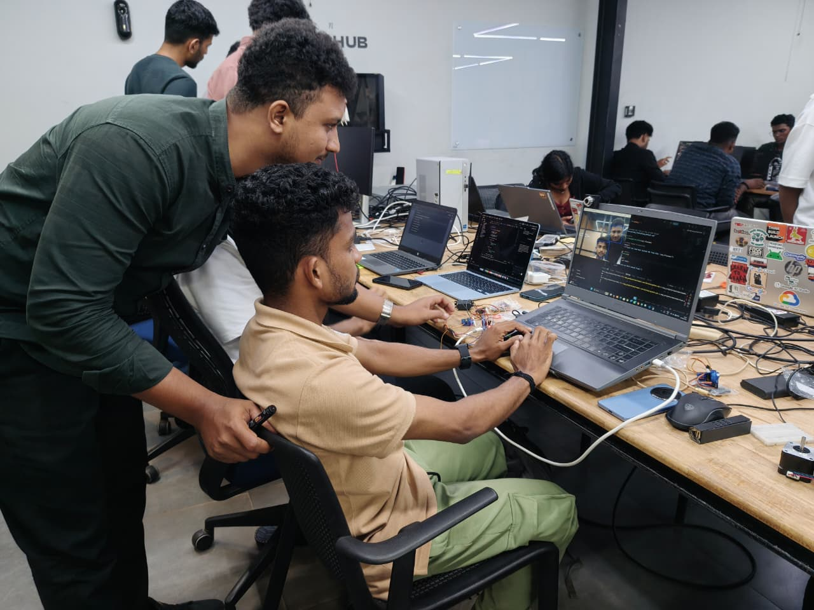</td>
    <td width="50%">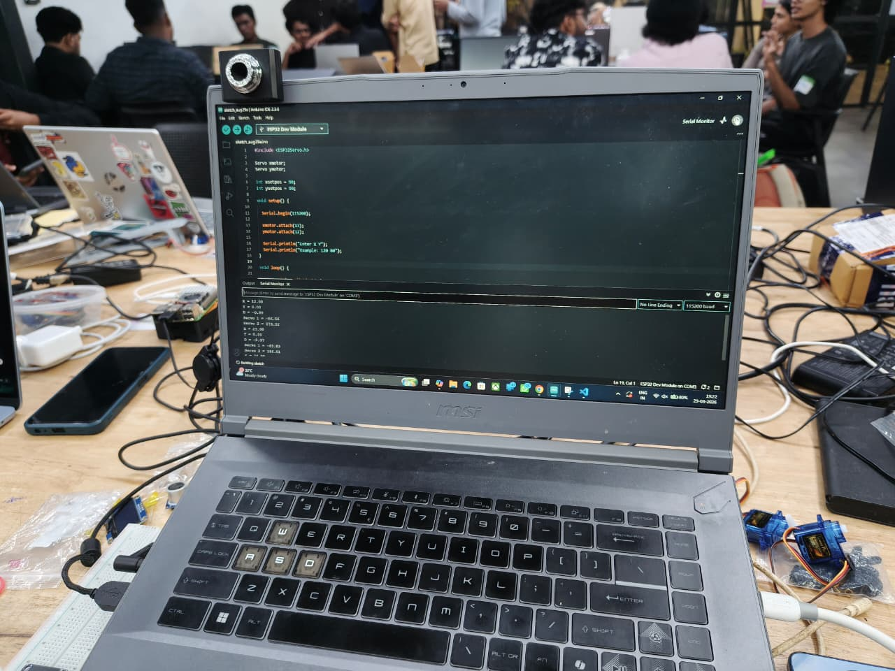</td>
  </tr>
</table>

### Phase 2

<table>
  <tr>
    <td width="50%">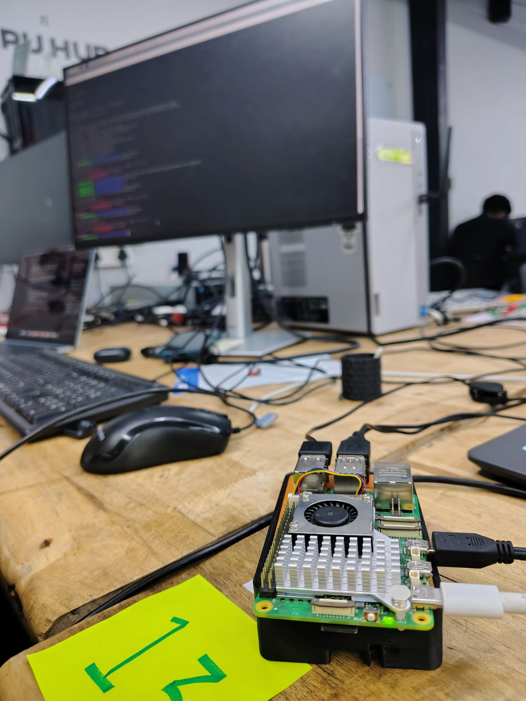</td>
    <td width="50%">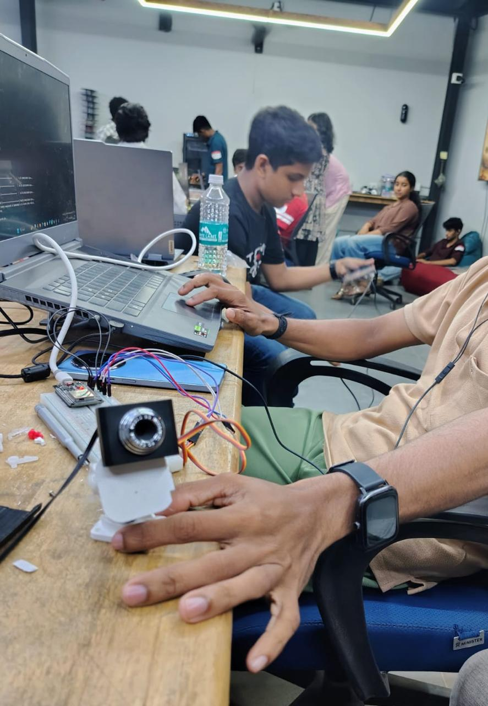</td>
  </tr>
  <tr>
    <td width="50%">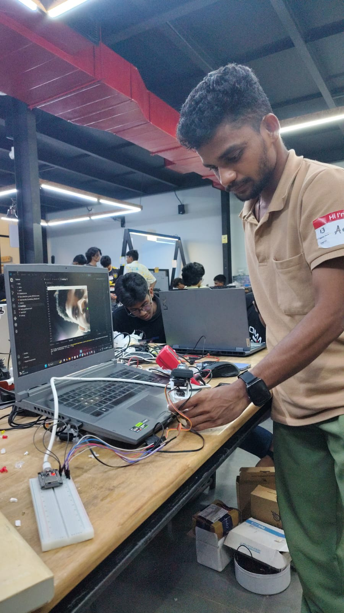</td>
    <td width="50%">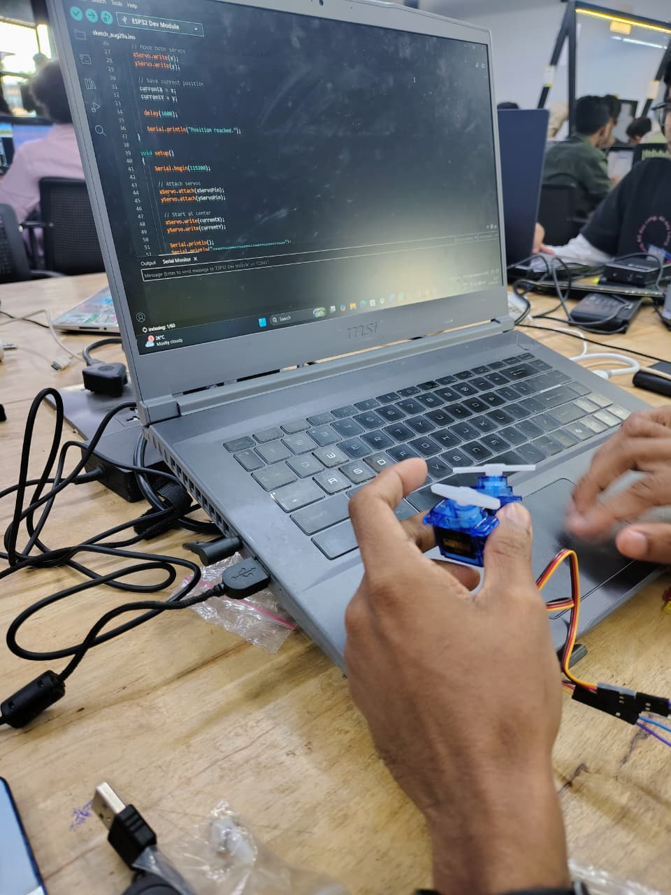</td>
  </tr>
</table>

### Phase 3

<table>
  <tr>
    <td width="50%">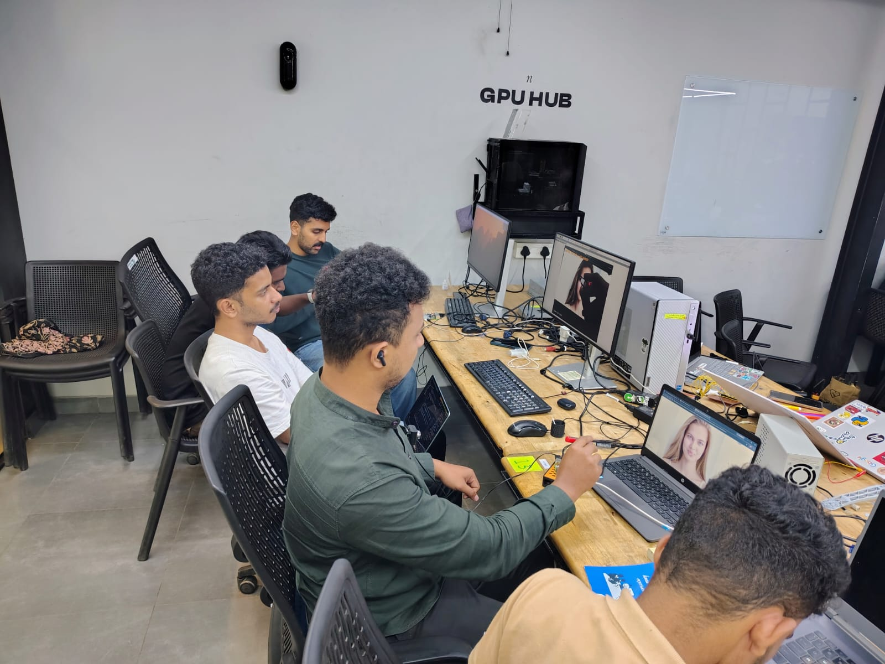</td>
    <td width="50%">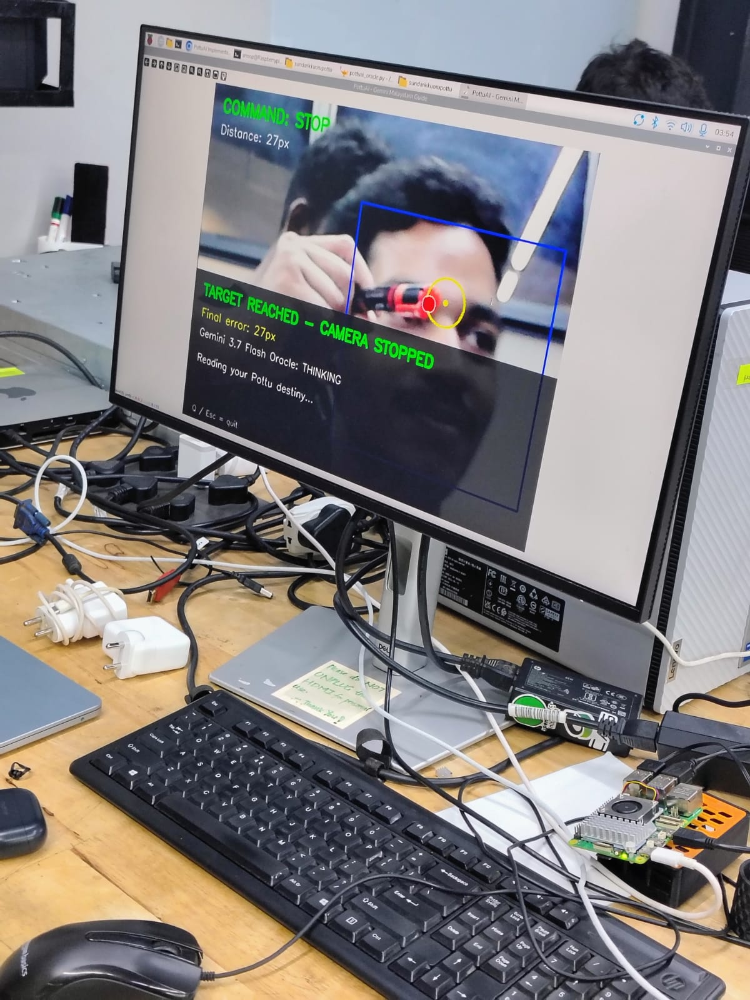</td>
  </tr>
  <tr>
    <td width="50%">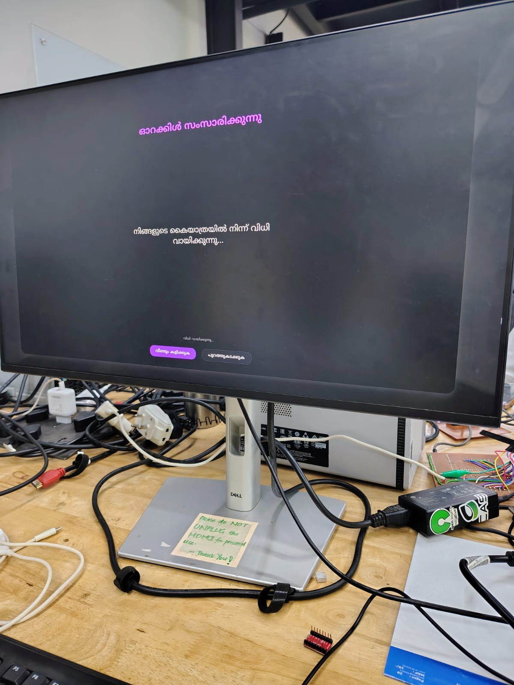</td>
    <td width="50%">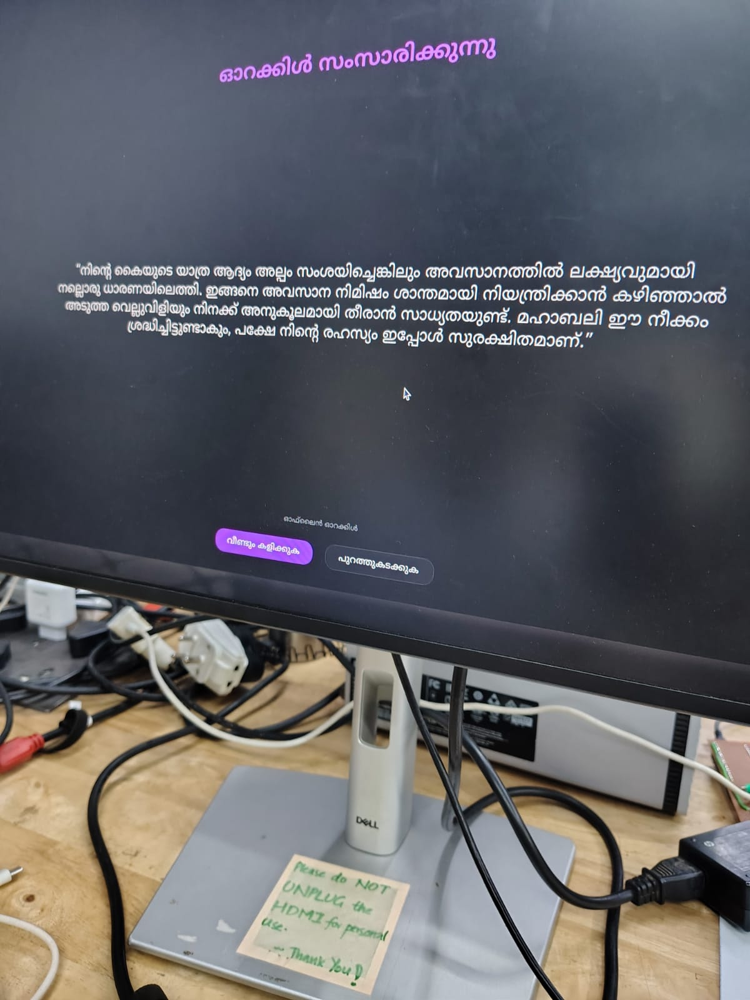</td>
  </tr>
</table>
